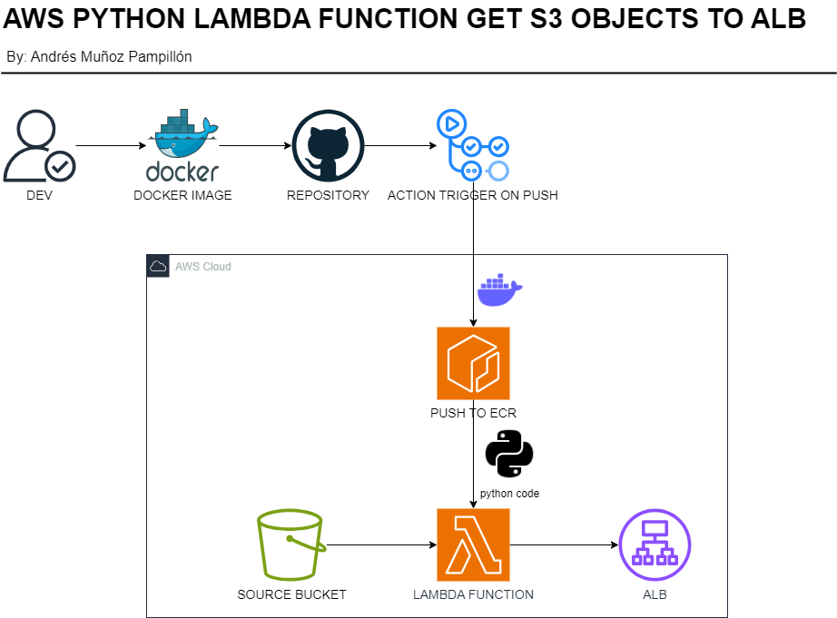

# AWS LAMBDA FUNCTION CONTAINER + AUTO UPDATE W/ GITHUB ACTIONS

Este repositorio es un showcase sobre cómo crear una función lambda de aws, que en este caso detecta los objetos creados en un datalake S3 y los envía a un Load Balancer por HTTP.
Cada vez que se realiza un cambio en el código el container se actualiza automáticamente gracias a github actions.



## ➡️​ CREACIÓN FUNCIÓN LAMBDA

En este caso la función lambda que se desarrolla responde a una necesidad de detectar los objectos creados en un Datalake S3 de AWS
y enviarlos por HTTP a un Load Balacer para posteriormente ser procesados por un pipeline.
Para ello se deben seguir los siguientes pasos:
 - En una carpeta SCR crear un archivo main.py el cual contiene el código a ejecutar por la función.
 - En el directorio principal del proyecto se debe crear un archivo Requirements.txt que contendrá el nombre de las librerías a importar.
 - Además se debe crear un Dockerfile donde se define que imagen base se va a utilizar, las librerías a instalar y cuál es la función principal a ejecutarse.

## ➡️​ CREACIÓN CONTAINER

Una vez creado terminado el código se debe crear el container. Para ello en la terminal se debe ejecutar:

```sh
docker build -t lambda-s3-alb-container:0.0.1 .
``` 

Una vez creado el container se puede ejecutar para comprobar que no existan problemas al lanzarlo con:

```sh
docker run -p 9000:8080 lambda-s3-alb-container:0.0.1
```

## ➡️​ ALOJAR IMAGEN EN GITHUB

Github permite almacenar imágenes de containers, para ello es necesario subirlo a Packages. Hacerlo es muy sencillo.
El primer paso es crear un Token que permita escribir y borrar paquetes. Para ello hay que dirigirse a:
> Settings -> Developer settings -> Personal Access Token -> Classic Token

Y al crear un nuevo token marcar write:packages y delete:packages

---
Una vez creado el token es momento de crear la conexión con github para poder realizar push.
Para ello en la terminal reemplazando el valor del token hay que escribir:

```sh
docker login --username TU_USERNAME --password TOKEN_VALUE ghcr.io
```
Como paso previo a realizar el push es necesario realizar el tag de la imagen de la forma correcta.
Esta debe seguir el patrón de github container respository. 
```sh
docker build . -t ghcr.io/andresmup/lambda-s3-alb-container:latest
```
Ahora ya estaría todo listo para realizar el push:
```sh
docker push  ghcr.io/andresmup/lambda-s3-alb-container:latest
```
De esta forma la imagen del container docker se alojará en la sección de packages en nuestra cuenta de Github.

## ➡️​ AUTO UPDATE CONTAINER CON GITHUB ACTIONS

Con Github Actions es posible realizar un auto update del container y que actualizar la imagen guardada en packages cada vez que se haga un commit.
Esto permite que cada vez que se realicen cambios en el código en la rama main por consiguiente la imagen subida se construya de nuevo y una nueva versión sea alojada.
Permitiendo tener en Github Packages un historial con las diferentes versiones del container.

Para ello es necesario realizar los siguientes pasos:
- En el repositorio que aloja el código del container Docker hay que agregar una Secret.
  > Settings -> Security -> Secrests and variables -> New repository key
  
  En esta nueva key como name pondremos GH_TOKEN y como valor el token generado anteriormente.
- En el directorio del repositorio hay que crear una carpeta llamada .github y adentro de esta una llamada workflows
- Dentro de workflows hay que crear un archivo publish-ghcr.yaml
- El código que contiene debe seguir la siguiente estructura donde se utilizaran en run los mismos comandos usados para subir la imagen anteriormente de forma manual.
  ```yml
  name: Docker image CI for CHCR
  on:
    push
  
  jobs:
    build_and_publish:
      runs-on: ubuntu-latest
      steps:
        - uses: actions/checkout@v4
        - name: Build and push the images
          run: |
            docker login --username Andresmup --password ${{ secrets.GH_TOKEN}} ghcr.io
            docker build . -t ghcr.io/andresmup/lambda-s3-alb-container:latest
            docker push  ghcr.io/andresmup/lambda-s3-alb-container:latest
  ```

Y con esto sería suficiente. Github gracias a este archivo publish-ghcr.yaml ejecutara los pasos definidos adentro y automáticamente creará una nueva imagen 
del container docker que alojada en la sección de packages.

---
♻️ Adapta los comandos en función de tu nombre de usuario en github y el nombre que deseas utilizar para el container.

💬 Gracias por visitar mi repositorio. Si tienes alguna duda o sugerencia, no dudes en contactar. 💬

👨‍💻 Andrés Muñoz Pampillón


